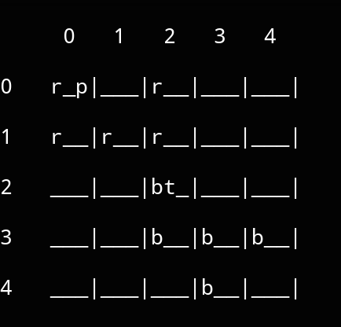

# **Antiyomacy**
An implementation of a strategy game heavily inspired by Antiyoy and with some elements of Diplomacy. The project is focused on developing AI software that manages to play the game using the minimax algorithm.

## 📘 Index

* [Code structure](#code_structure)
* [Screenshots](#screenshots)

## 📐 Code structure
The code is structured as follows, listing the main predicates for each file:

### Game core files
- `hex.pl`
    - **tile/1** : The list of tiles type
    - **owner/1** : The list of players
    - **hex/6**: The struct of an hex in the map
---
- `map.pl`
    - **generate_random_map/1** : Generates a random map using the Random Walkers algorithm
    - **inside_map/1** : Checks if a coordinate lies within the map boundaries
    - **get_hex/2** : Retrieves the hex at the given coordinate
    - **set_owner/2** : Change an hex owner
    - **set_building/2** : Spawns a building on a given coordinate
    - **set_unit/** : Spawns a unit on a given coordinate
---
- `province.pl`
    - **province/3** : The struct of a player's province
    - **boundary/3** : Search for adjacent hexes around the given one
    - **find_provinces/1** : Find all the provinces in the map
    - **province_boundary/3** : Find all hexagons that border the given province externally
    - **frontier/3** : Find all hexagons that border the given province internally
---
- `building.pl`
    - **building/4** : The list of the buildings that can be built
    - **tower_nearby/3** : Checks if there is an enemy tower nearby that prevents a unit move 
---
- `unit.pl`
    - **unit/5** : The list of the units that can be bought
    - **move_unit/4** : Checks whether a given unit can be moved to a certain
---
- `economy.pl`
    - **get_income/2** : Calculate a province income. This will be added to the province money at the end of the turn.
    - **buy/2** : Checks whether a building or unit purchase can be achieved

### Other files
- `printer.pl`
    - **print_map/1** : Print a map row with lateral coordinates
---
- `game.pl`
    - **test/0** : Test various game predicates

## 🖼 Screenshots

