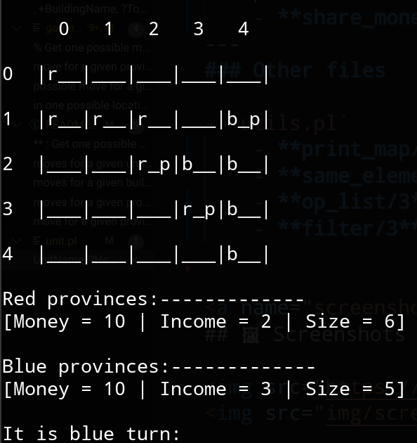

# **Antiyomacy**
An implementation of a strategy game heavily inspired by Antiyoy and with some elements of Diplomacy. The project is focused on developing AI software that manages to play the game using the minimax algorithm.

## 📘 Index

* [Code structure](#code_structure)
* [Screenshots](#screenshots)

## 🎲 Moves in the game
In Antiyoy the two players, Red and Blue, take turns. In each player's turn, they can choose from the following three types of moves:

| Move  | How many times it can be made |  
|---|---:|
|***Buy a unit*** | for each province, until its money runs out  |
|***Buy a building***   |  for each province, until its money runs out |
|***Displace a unit***   |  for each unit in each province | 

Now, it is important to note that there are three different ways in which a unit can be moved:
- **Conquer an enemy tile** (if possible): the unit moves to the outer border of its province.
- **Defend the border of its province**: the unit moves inside the inner border of its province.
- **Merge with another unit** (if possible): the unit moves to the location of another unit and the two form a stronger unit.
---
In Antiyomacy, however, the list of possible moves for each turn has been reduced for performance issues:

| Move  | How many times it can be made |  
|---|---:|
|***Buy a unit or building*** | for each province, if any displacement has taken place, once  |
|***Displace a unit***   |  for each province, if no purchase has taken place, once | 

---
### Predicates used

**Buy a unit** : 
`province:buy_and_place/8` ---> (`economy:check_buy/3`, `province:place_unit/5` ---> `unit:unit_placement/5` ---> `unit:unit_mergeable/4`)

**Buy a building** : 
`province:buy_and_place/8` ---> (`economy:check_buy/3`, `building:building_placement/4`)

**Displace a unit** : 
`province:displace_unit/8` ---> `province:place_unit/5` ---> `unit:unit_placement/5` ---> `unit:unit_mergeable/4`

## 🪓 Province merge/split algorithm
As you can see in the following image, handling the possibility of merging or splitting provinces after an attack is quite tricky.

This is due to the need for a map scan after each attack. Since the goal of this project revolves around the minimax algorithm, it is clear that runtime performance is of utmost importance. This means that it would be nice to avoid recalculating all provinces on every move (with the `province:find_provinces/2` predicate) due to the complexity of the breadth-first search. Furthermore, even if you did this after every move, there is still the problem of identifying which provinces have split or merged with which other provinces.

That being said, we propose a lazy algorithm that takes advantage of sufficient conditions for both merge and split cases to reduce the use of breadth-first search for province recalculation. Let's break down this algorithm:

### Search for a merge
1. A province merge can only occur after a unit has conquered an unoccupied hex or invaded an enemy hex;
2. If this is the case, find all the player's provinces in the list of the old provinces that touch the area around the conquered hex,
3. Calculate the money of the newly merged province as the sum of the money of these found provinces,
4. Remove these provinces from the list of the provinces.
5. Add the new player's province that was found with a breadth-first search around the conquered hex.

### Search for a split
1. An enemy province split can only occur after a unit has invaded an enemy hex;
2. If this is the case, check if there are any non-adjacent enemy hexes in the surrounding of the invaded hex,
3. If this is the case, select one of these hexes and check that it is not connected to all the other hexes surrounding the invaded hex, using a breadth-first search,
4. If this is the case, a split has certainly occurred. Find all the provinces using a breadth-first on the enemy hexes surrounding the invaded hex,
5. Select the split province from the list of the old provinces and use it to calculate the new split provinces' money,
6. Remove the former and add the latter to the list of provinces.
7. Otherwise, if the split hasn't happened, the invaded enemy province will still have to be recalculated due to the attack.

The use of these two predicates in sequences makes it possible to detect the occurrence of both simultaneous splitting and merging.
These two algorithms are implemented in the predicates `province:check_for_merge/5` and `province:check_for_split/5` respectively.

## 📐 Code structure
The code is structured as follows, listing the main predicates for each file.
Note: The term "resource" refers to both units and buildings.

### Minimax files
- `minimax.pl`
    - **board/4** : The board struct. This holds all the information needed to determine one game state, namely the map, the list of provinces, the current player and the state of the game.
    - **minimax/4** : Finds the best move using minimax with alpha-beta pruning
    - **best_board/4** : Finds the best board from a list of possible successors, whose value always remains within the Alpha and Beta limits.
    - **update_alpha_beta/3** : Updates the values of Alpha and Beta.
    - **better/3** : Returns the best configuration based on the player's turn. In case of equality, a random board is choosen
- `eval.pl`
    - **eval/2** : Calculates the evaluation function on a provided board.

---
### Game controller file
- `game.pl`
    - **play/3** : Plays the game.
    - **has_won/3** : Checks if the player has won. A player wins if they own at least 80% of the terrain map hexes or there are no more enemy provinces.
    - **move/4** : Get one possible move. (❓non-deterministic❓)
    - **test/0** : Test various game predicates.

---
### Game core files
- `hex.pl`
    - **tile/1** : The list of tiles type.
    - **owner/1** : The list of players.
    - **hex/6**: The struct of an hex in the map.
    - **manhattan_distance/3** : Calculate the Manhattan distance between two hexes.

- `map.pl`
    - **generate_random_map/2** : Generates a random map using the Random Walkers algorithm.
    - **inside_map/1** : Checks if a coordinate lies within the map boundaries.
    - **get_hex/3** : Retrieves the hex at the given coordinate.
    - **set_owner/4** : Change an hex owner.
    - **set_building/4** : Spawns a building on a given coordinate.
    - **set_unit/4** : Spawns a unit on a given coordinate.
    - **destroy_units/3** : Destroy all units located on the specified hexes on the map. This is useful for handling bankruptcy cases.
    - **spawn_provinces/2** : Randomly spawns a red and a blue province. This is used at the start of a game. (⬆️higher-order⬆️)
    - **set_hexes_to_empty/3** : Sets the specified hexes unit, building and owner in the hex list to none.
    - **get_non_sea_hexes/2** : Get all hexes on the map that do not have 'sea' in their tile.

- `province.pl`
    - **province/3** : The struct of a player's province.
    - **province_count/3** : Checks or calculates the number of buildings or units owned by the province.
    - **update_province/3** : Reload all the hexes in the old province hex list, remove conquered hexes from the enemy and add the hexes conquered by the player.
    - **refresh_province/4** : Refresh only the provided coords on the given province, or add them if not already owned. This is faster than update_province.
    - **apply_income/4** : Add the income to the province money and go bankrupt if necessary.
    - **near/3** : Search for adjacent hexes around the given one.
    - **find_provinces/2** : Find all the provinces in the map.
    - **outer_border/3** : Find all hexagons that border the given province externally.
    - **inner_border/3** : Find all hexagons that border the given province internally.
    - **buy_and_place/8** : Purchase a building or a unit and place it on the map at the given location.
    - **displace_unit/8** : Displace a unit on a given valid hex.
    - **place_unit/8** : Place a unit on a given hex after checking the validity of the move.
    - **check_for_merge/5** : Checks if a province has been merged.
    - **check_for_split/5** : Checks if a province has been split.
    - **get_hexes_from_provinces/2**: Given a list of provinces, get the combined list of hexes.

- `unit.pl`
    - **unit/5** : The list of the units that can be bought.
    - **unit_placement/5** : Checks/Gets a unit valid location on the given province. This is useful to list all the possible placement moves for a given unit. (❓non-deterministic❓)

- `building.pl`
    - **building/4** : The list of the buildings that can be built.
    - **building_cost/3** : Calculates the construction cost of a building based on its type.
    - **tower_nearby/3** : Checks if there is an enemy tower nearby that prevents a unit move.
    - **strong_tower_nearby/3** : Checks if there is an enemy strong tower nearby that prevents a unit move.
    - **farm_nearby/4** : Checks if there is a farm nearby, useful to check where a farm can be placed.
    - **building_placement/4** : Checks/Gets a building valid location in the given province. This is useful to list all the possible placement moves for a given building. (❓non-deterministic❓)

- `economy.pl`
    - **get_income/2** : Calculate a province income. This will be added to the province money at the end of the turn.
    - **check_buys/3** : Checks if a list of resources can be bought and returns the remaining money of the province. This is useful to list all the possible purchase moves for a given province. (❓non-deterministic❓)
    - **check_buy/3** : Checks whether a building or unit purchase can be achieved and returns the remaining money of the province. This is useful generate one possible purchase move for a given province. (❓non-deterministic❓)
    - **share_money/5** : Calculates the proportional share of split/merged provinces based on the original provinces.
---
### Other files

- `utils.pl`
    - **lap/0** : Takes a stopwatch lap and print the elapsed time. This is useful for benchmarking purposes.
    - **print_provinces/1** : Print a list of provinces in a nice pleasant way
    - **print_map/1** : Print a map row with lateral coordinates.
    - **same_elements/2** : Check whether two lists contain the same elements, regardless of their order
    - **op_list/3** : Invoke an operation on all the elements of a list. (⬆️higher-order⬆️)
    - **filter/3** : Filter a list with a condition related to the list being generated. (⬆️higher-order⬆️)
    

## 🖼 Screenshots

